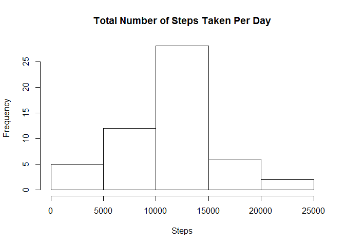
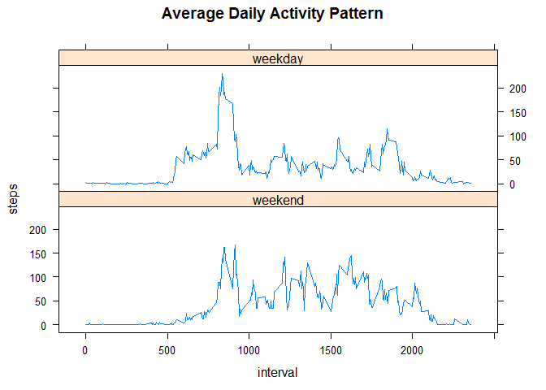

# Reproducible Research: Peer Assessment 1

## Introduction

Data is collected from a personal monitoring device such as a [Fitbit](http://www.fitbit.com/), [Nike Fuelband](http://www.nike.com/us/en_us/c/nikeplus-fuelband), or [Jawbone Up](https://jawbone.com/up). The data consists of two months of data from an anonymous individual collected during the months of October and November, 2012 and include the number of steps taken in 5 minute intervals each day.

The data can be downloaded [here](https://d396qusza40orc.cloudfront.net/repdata%2Fdata%2Factivity.zip).

## Loading and preprocessing the data

1. If necessary, download the data as a zip file.
2. Unzip the zip file.
3. Read the data


```r
if (!file.exists("activity.zip")) {
  download.file("https://d396qusza40orc.cloudfront.net/repdata%2Fdata%2Factivity.zip", destfile = "activity.zip");
}

if (!exists("activity")) {
  unzip("activity.zip");
  activity <- read.csv("activity.csv");
  file.remove("activity.csv");
}
```

## What is mean total number of steps taken per day?

Sum the number of steps taken in each measurement, grouped by date:


```r
stepsbydate <- aggregate(steps ~ date, activity, FUN = sum);
```

A histogram of the total number of steps taken each day:


```r
hist(stepsbydate$steps, main = "Total Number of Steps Taken Per Day", xlab = "Steps");
```



The mean total number of steps taken per day is 

```r
mean(stepsbydate$steps);
```

```
## [1] 10766.19
```
 and the median total number of steps taken per day is 

```r
median(stepsbydate$steps);
```

```
## [1] 10765
```

## What is the average daily activity pattern?

Find the average number of steps, grouped by interval:


```r
stepsbyint <- aggregate(steps ~ interval, activity, FUN = mean);
plot(stepsbyint, type='l', main = "Average Daily Activity Pattern");
```


The maximum number of steps taken in a given interval:


```r
stepsbyint[which.max(stepsbyint$steps),]
```

```
##     interval    steps
## 104      835 206.1698
```

## Imputing missing values

Number of NA values:


```r
sum(is.na(activity$steps));
```

```
## [1] 2304
```

Use the average number of steps in the given interval for NA values:


```r
newactivity <- activity;
for (i in 1:length(newactivity$steps)) {
  if (is.na(newactivity[i, 1])) {
    newactivity[i, 1] = stepsbyint[stepsbyint$interval == newactivity$interval[i], 2];
  }
}
```

Sum the number of steps taken in each measurement, grouped by date:


```r
newstepsbydate <- aggregate(steps ~ date, newactivity, FUN = sum);
```

A histogram of the total number of steps taken each day:


```r
hist(newstepsbydate$steps, main = "Total Number of Steps Taken Per Day", xlab = "Steps");
```


The mean total number of steps taken per day is 

```r
mean(newstepsbydate$steps);
```

```
## [1] 10766.19
```
 and the median total number of steps taken per day is 

```r
median(newstepsbydate$steps);
```

```
## [1] 10766.19
```

## Are there differences in activity patterns between weekdays and weekends?

First, a homemade function to determine whether a day is a weekday or not:


```r
library(lubridate);
isWeekday <- function(x) { return (wday(x) != 1 & wday(x) != 7); }
```

Add a column to the data frame showing if it is the weekday or weekend:


```r
newactivity$day <- factor(isWeekday(ymd(newactivity$date)), labels = c("weekend", "weekday"));
```

Find the average number of steps taken per interval, split by weekdays and weekends:


```r
newstepsbyint <- aggregate(steps ~ (interval + day), newactivity, FUN = mean);
```

A line chart, plotted with the lattice package:


```r
library(lattice);
xyplot(steps ~ interval|day, data = newstepsbyint, type = 'l', layout = c(1, 2), main = "Average Daily Activity Pattern");
```



----------

Course project for [Reproducible Research](https://www.coursera.org/learn/reproducible-research).
